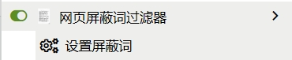
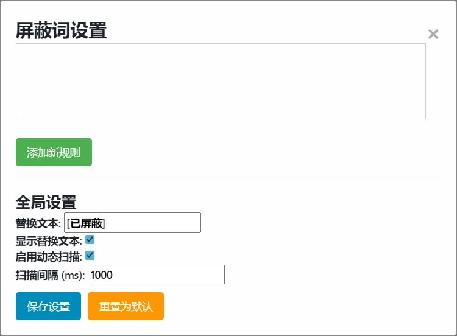
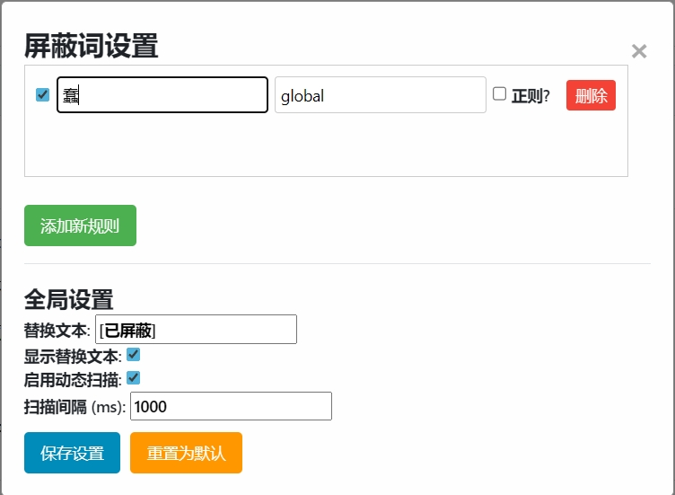
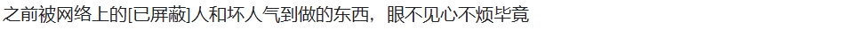
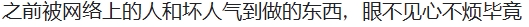

# Word-Blocker 网页文字屏蔽词脚本
Simple temper monkey script.

简单的网页屏蔽词の油猴脚本。
支持正则屏蔽
目前只能屏蔽文字元素 ~~（屏蔽其他的请出门左转Adblock（（~~

之前被网络上的蠢人和坏人气到做的东西，眼不见心不烦毕竟

##  Usage 用法

~~虽然我觉得界面已经很直观了~~

1. （如果你没还下的话）**下载[Temper Monkey](http://tampermonkey.net/)**
    - Edge: [Edge Addons](https://microsoftedge.microsoft.com/addons/detail/tampermonkey/iikmkjmpaadaobahmlepeloendndfphd)
    - Chrome: [Chrome Web Store](https://chrome.google.com/webstore/detail/tampermonkey/dhdgffkkebhmkfjojejmpbldmpobfkfo)
    - Firefox: [Firefox Add-ons](https://addons.mozilla.org/en-US/firefox/addon/tampermonkey/)

2. 下载[word_blocker.user.js](https://github.com/ZJX54959/Word-Blocker/releases/download/publish/word_blocker.user.js)

3. 在自动弹出的窗口中确认安装

    ---

4. 如果**安装成功**，你应该能在油猴插件图标下找到此脚本
    

5. 点击<kbd>设置屏蔽词</kbd>，应有UI弹出
    

6. 点击<kbd>添加新规则</kbd>，在输入框内输入想要屏蔽的内容，保存设置
    

7. 成功了，应该
   没成功就刷新下网页
      
     `^ 上面那句话屏蔽后的效果`

---

## Setting 其他设置

- 添加新规则时勾选**正则**能启用正则语法屏蔽
- 不想见替换文本可以取消勾选**显示替换文本**，或者直接删掉替换文本
    
    `^ 上面那句话不显示替换文本屏蔽后的效果`
- 动态扫描是应对一些网页上动态加载的内容，比如评论区？


---

## Tips 技巧

屏蔽效果不好，想把含有屏蔽词的整段话都屏蔽掉？
可以在添加屏蔽词时勾选**正则**，并把屏蔽词改为
```
^.*【屏蔽词】.*$
```